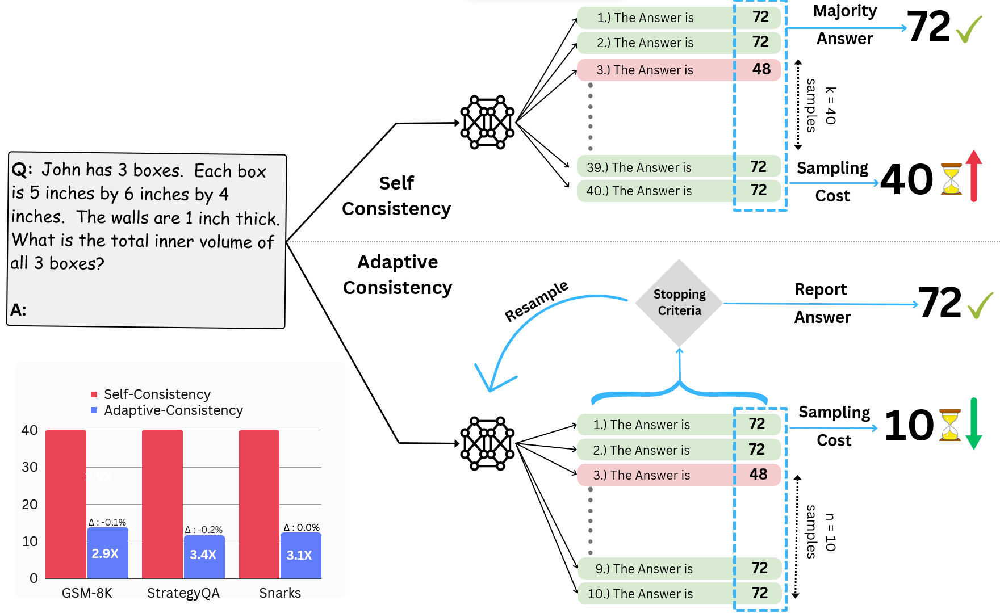

# Let's Sample Step by Step: Adaptive-Consistency for Efficient Reasoning with LLMs

<p align="center">
  <a href="http://sample-step-by-step.info/">Website</a> •
  <a href="https://arxiv.org/abs/2305.11860">Paper</a> 

</p>


<p align="center">
    <a href="https://github.com/Pranjal2041/AdaptiveConsistency/blob/master/LICENSE">
            
    </a>
    <a href="https://twitter.com/intent/tweet?text=Check%20out%20AdaptiveConsistency%3A%20https%3A%2F%2Fgithub.com%2Fpranjal2041%2FAdaptiveConsistency">
    
    </a>
    <a href="https://pypi.org/project/AdaptiveConsistency/">
    
    </a>      
</p>


<!-- <br> -->
[Pranjal Aggarwal](https://github.com/Pranjal2041), [Aman Madaan](https://madaan.github.io/), [Yiming Yang](https://www.cs.cmu.edu/~./yiming/),  [Mausam](https://www.cse.iitd.ac.in/~mausam/)
<!-- <br> -->

## Abstract
>A popular approach for improving the correctness of output from large language models (LLMs) is Self-Consistency - poll the LLM multiple times and output the most frequent solution. Existing Self-Consistency techniques always draw a constant number of samples per question, where a better approach will be to non-uniformly distribute the available budget based on the amount of agreement in the samples drawn so far. In response, we introduce Adaptive-Consistency, a cost-efficient, model-agnostic technique that dynamically adjusts the number of samples per question using a lightweight stopping criterion. Our experiments over 13 datasets and two LLMs demonstrate that Adaptive-Consistency reduces sample budget by up to 6.0 times with an average accuracy drop of less than 0.1%.
>




# Adaptive Consistency: 
This repository contains code for:
1. Adaptive-Consistency Library for Running efficient LLM generation using [Adaptive-Consistency](http://sample-step-by-step.info) in your code.
2. Code to reproduce results of [Adaptive-Consistency](https://arxiv.org/abs/2305.11860).

## Installation

### From PyPi

```bash
pip install AdaptiveConsistency
```

### From Source

First, clone the repo:
```bash
git clone https://github.com/Pranjal2041/AdaptiveConsistency.git
```

Next install the package using: 
```bash 
python setup.py install
```

## Usage

Using Adaptive Consistency in your code requires only 2-3 lines of changes in your existing framework.

### 1. Importing the library

```python
from adaptive_consistency import AC, BetaStoppingCriteria
```

### 2. Initializing the library

```python
ac = AC(model, stopping_criteria=BetaStoppingCriteria(0.95), max_gens = 40)
```

Default stopping_criteria is BetaStoppingCriteria with confidence threshold = 0.95 (as used in the paper). 

### 3. Using the library

You can directly run a whole loop of evaluation using:

```python
ac.eval_loop(sampling_function, *args, **kwargs)
```

For example, if using Openai api for sampling, you can use:

```python
import openai

answers = ac.eval_loop(openai.Completion.create, engine="text-davinci-003", prompt="Solve the following question:", max_tokens=5)
```

Or you can check for consistency of answers (and decide to break) at each step:

```python
answers = []
for i in range(40):
    answers.append(generate_answer_from_model()) # Example openai.Completion.create
    if ac.should_stop(answers):
        break
```

Note: In the `generate_answer_from_model` function, you may want to extract the final answer after sampling from LLM.


### 4. Stoppping Criterias

You can use one of the following Stopping Criterias:

1. `BetaStoppingCriteria (beta)`: Uses the Beta Distribution to guide the stopping criteria. This is the default stopping criteria.
2. `DirichletStoppingCriteria (dirichlet)`: Uses the Dirichlet Distribution to guide the stopping criteria.
3. `EntropyStoppingCriteria (entropy)`: Uses the Entropy of the distribution to guide the stopping criteria.
4. `MajorityStoppingCriteria (majority)`: Uses the Majority ratio of the top element in the distribution to guide the stopping criteria.
5. `RandomStoppingCriteria (random)`: Randomly stops the sampling process with a pre-defined probability.
6. `CRPStoppingCriteria (crp)`: Uses the Chinese Restaurant Process to guide the stopping criteria.

Check out the [paper](https://arxiv.org/abs/2305.11860) for more details.


## Reproducing Numbers


### 1. Downloading the data

Run, 

```bash
bash download_data.sh
```

### 2. Downloading Model Outputs

We provide the model outputs for all the models used in the paper. You can download them using:

```bash
bash download_outputs.sh
```

These model outputs will work for all experiments in the paper.

### 3. Running Generations

If you decide to skip the previous step, you can run your generations on your own. You can use the following command:

```bash
bash scripts/run_self_consistency.sh
bash scripts/run_adaptive_consistency.sh
```

By default, `beta` function will be used for stopping criteria. You can change it by passing the `stopping_criteria` and corresponding Confidence Threshold as arguments. For example, to use `entropy` stopping criteria, with a Confidence Threshold of 0.75, you can use:

```bash
bash scripts/run_adaptive_consistency.sh entropy 0.75
``` 

This step will print the final accuracy on the terminal.

### 4. Running Eval on Model Outputs

You can skip Step 3, and directly run eval on the model outputs. You can use the following command:

```bash
python eval_outputs.py --output_file <path_to_output_file> --stop_criteria <stop_criteria> --stop_criteria_thresh <stop_criteria_thresh>
```

This will print the average generations and accuracy on the terminal.


## Citation

```bibtex
@misc{aggarwal2023lets,
      title={Let's Sample Step by Step: Adaptive-Consistency for Efficient Reasoning with LLMs}, 
      author={Pranjal Aggarwal and Aman Madaan and Yiming Yang and Mausam},
      year={2023},
      eprint={2305.11860},
      archivePrefix={arXiv},
      primaryClass={cs.CL}
}
```

## LICENSE

Adaptive-Consistency is Apache licensed, as found in the [LICENSE](LICENSE) file.